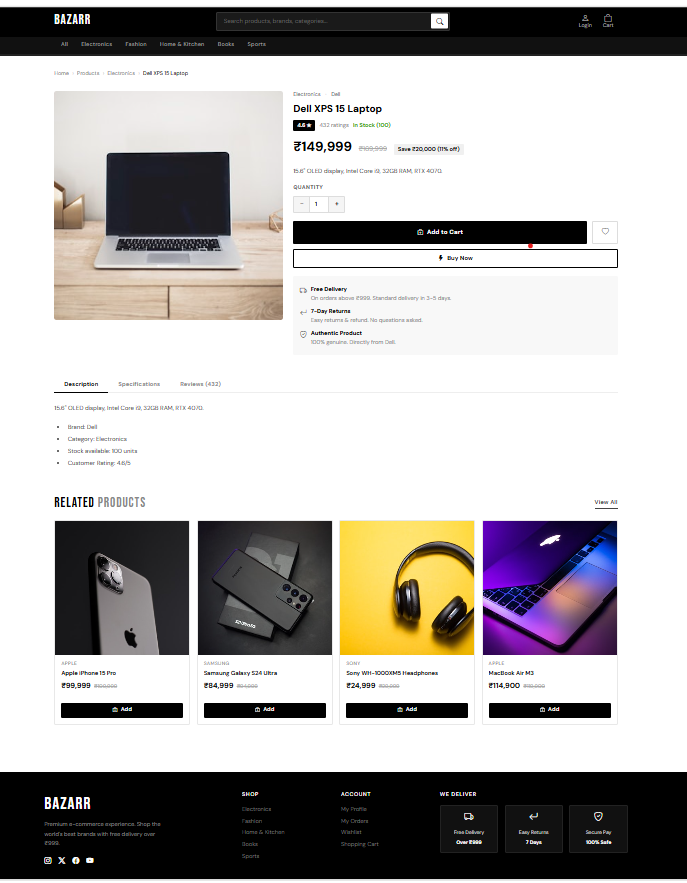

# 🚀 Bazarr - Smart Product Recommendation System

## 📌 Overview

Bazarr is a machine learning-based smart product recommendation system that analyzes customer purchase patterns and suggests relevant products using association rule mining (Apriori algorithm).

This project demonstrates how data-driven techniques can be used to enhance user experience in e-commerce platforms by providing intelligent product recommendations.

---

## 🎯 Key Features

* 🧠 Product recommendation using Apriori Algorithm
* 📊 Data analysis on Amazon product dataset
* 📦 Automated product addition system
* 📧 Email notification service integration
* 🌐 Web-based interface using Flask
* 🖼️ Image handling for products

---

## 🛠️ Tech Stack

* **Backend:** Python, Flask
* **Machine Learning:** Apriori Algorithm
* **Data Processing:** Pandas, NumPy
* **Frontend:** HTML, CSS
* **Database:** SQLite (instance folder)
* **Other:** Email Service Integration

---

## 📂 Project Structure

```
Bazarr-/
│── app.py                 # Main Flask application
│── apriori.py             # Recommendation logic using Apriori
│── add_products.py        # Script to add products
│── import_scripts.py      # Data import utilities
│── email_service.py       # Email sending functionality
│── images.py              # Image processing
│── amazon.csv             # Dataset
│── templates/             # HTML pages
│── static/                # CSS, JS, images
│── instance/              # Database files
│── requirements.txt       # Dependencies
│── render.yaml            # Deployment config
│── README.md              # Documentation
```

---

## ⚙️ Installation & Setup

### 1️⃣ Clone Repository

```bash
git clone https://github.com/yourusername/Bazarr-project.git
cd Bazarr-project
```

### 2️⃣ Create Virtual Environment

```bash
python -m venv venv
venv\Scripts\activate
```

### 3️⃣ Install Dependencies

```bash
pip install -r requirements.txt
```

---

## ▶️ Run the Application

```bash
python app.py
```

👉 Open browser:

```
http://127.0.0.1:5000/
```

---

## 📊 How It Works

* The system reads transaction/product data from `amazon.csv`
* Applies **Apriori Algorithm** to find frequent itemsets
* Generates association rules
* Recommends products based on user selection

---

## 📸 Screenshots

👉 

---

## 🚀 Deployment

This project includes `render.yaml`
You can deploy easily on **Render**

---

## 🔮 Future Enhancements

* Improve recommendation accuracy
* Add user login system
* Integrate real-time database
* Enhance UI/UX design
* Add advanced ML models

---

## 🤝 Contribution

Feel free to fork this repository and contribute!

---

## 📧 Contact

**Shilpa Tumma**
📩 shilpatumma21@gmail.com

---

If you found this project useful, please ⭐ the repository!
